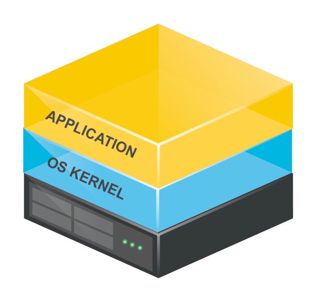
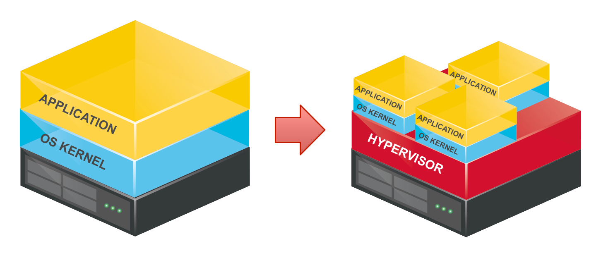
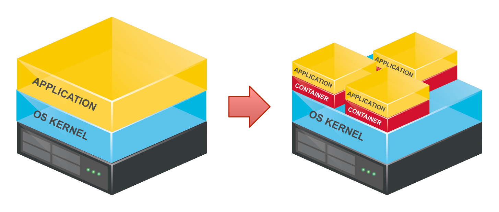
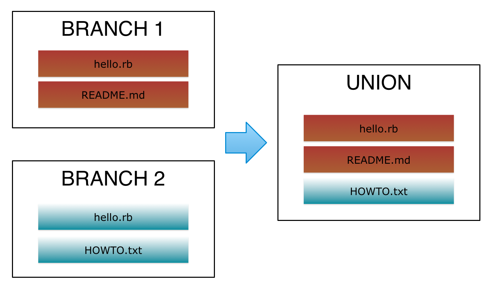

# Containers


## all the way down

---

## Containerisation

# is not

## virtualisation

---

## Containers

# are not

## Hypervisors

---

# Why virtualise?

60s-70s
Big mainframes, time-sharing
CP-65 for CP/CMS OS by IBM

---

# Why virtualise?

cheap x86
**low infrastructure utilisation**

---

# Why virtualise?

cheap x86
**low infrastructure utilisation**

define **low**?

---

# Why virtualise?

**VERY LOW**
infrastructure utilisation

* 5% - [McKinsey's Data Center study, 2008](http://www.mckinsey.com/clientservice/bto/pointofview/pdf/BT_Data_Center.pdf)
* 8% - [Accenture paper, 2011](https://048744ef-a-62cb3a1a-s-sites.googlegroups.com/site/huanliu/cgc.pdf)
* 12% - Gartner, 2012

---

# How to virtualise?

* Hypervisors
* Containers

---

## Hypervisors

first mentioned in 1965, for IBM's system.

* 1988 - first SoftPC for Macintosh; can only run DOS, later - Win 3.x, 9x
* 1997 - Connectix VirtualPC for Macintosh, later sold to Microsoft

---

## Hypervisors



---

## Hypervisors



---

## Hypervisors

* 2001 - VMWare GSX Server, x86 Windows; Connectix VirtualPC for Windows
* 2003 - Xen, open-source hypervisor
* 2005 - free VMWare Player
* 2006 - VMWare Server, free Microsoft VirtualPC
* 2007 - VirtualBox Open Source Edition

---

## Containers


---

## Containers



guest OS can only be of the same kind (e.g. Windows or Linux) as the host OS.

---

## Containers

1982 - chroot (4.2BSD)

filesystem only

---

## chroot

[4.4BSD-Lite - sys/kern/vfs_syscalls.c](https://github.com/denghuancong/4.4BSD-Lite/blob/master/usr/src/sys/kern/vfs_syscalls.c#L520)

```c
chroot(p, uap, retval)
// ...
{
	register struct filedesc *fdp = p->p_fd;
	int error;
	struct nameidata nd;

	if (error = suser(p->p_ucred, &p->p_acflag))
		return (error);
	NDINIT(&nd, LOOKUP, FOLLOW | LOCKLEAF, UIO_USERSPACE, uap->path, p);
	if (error = change_dir(&nd, p))
		return (error);
	if (fdp->fd_rdir != NULL)
		vrele(fdp->fd_rdir);
	fdp->fd_rdir = nd.ni_vp;
	return (0);
}
```

---

## chroot

let's chroot something

```
sudo chroot -u `whoami` newroot
```

---

* 1982 - chroot (4.2BSD) (filesystem view only)
* 2000 - FreeBSD jail (fs + users, socket and process interaction restrictions)
* 2001 - Linux-VServer (with a kernel patch)
* 2005 - Solaris Zones (allow dedicated CPU, RAM, net-if controls, plus ZFS-powered features - snapshots and cloning)
* 2005 - OpenVZ - by SWSoft, aka Parallels (with a kernel patch)

---

* 2008 - LXC
* 2013 - lmctfy (Google's set of tools controlling cgroups)
* 2013 - Docker (leverages Linux cgroups and namespaces - first via LXC, then libcontainer)

---

# AuFS

## Advanced Multi Layered Unification Filesystem

unite several directories (branches) into a single virtual filesystem

---

# AuFS



---

# AuFS

```bash
sudo mount -t aufs -o br=~/work/dir01:~/work/dir02 none ~/view

mount -o remount ~/view
```

---

# Docker

* LXC
* AuFS
* Application-centric
* Toolset and ecosystem

---

# Docker

## LXC

namespaces and cgroups
process isolation

---

# Docker

## AuFS

layered filesystem (versioning)

---

# Docker

## Application-centric

deploying applications,
not servers

---

# Docker

## Toolset and ecosystem

* base images
* public registry
* standard containers
* third-party tools and workflows

---

# ClickME Application

Two containers:

* Ruby (trivial Sinatra app)
* Redis

---

# Docker on OSX

## boot2docker

runs a vm on VirtualBOX,
automatically installs/configures it

---

# Docker on OSX

## boot2docker

much better than it used to be,
but sometimes still buggy

---

# Docker on OSX

## boot2docker

```
> brew install boot2docker
> boot2docker help
> boot2docker init
> boot2docker start
```

---

# Dockerfile

## container definition

[Reference](https://docs.docker.com/reference/builder/)

just read it, it's a dozen of commands :)

---

# Let's build a container!

---

# Why? (Again)

---

## Why? (Again)

# Repeatable infrastructure

Containers + Registry

---

## Why? (Again)

# Immutable infrastructure

CoreOS

---

## Why? (Again)

# Immutable infrastructure

**Also a challenge - no local state/storage!**

---

## Why? (Again)

# Immutable infrastructure

### Network everything

* logs - syslogd/fluentd/logstash,
* files - object storage (S3/Swift/Riak)

---

## Why? (Again)

# Infrastructure as a code

Dockerfile

---

## Why? (Again)

# Easy preconfigured environments

docker-compose

---

## Why? (Again)

# Composable services

docker-swarm, fleet

---


# The cloud is coming!

---


# References

* [A Dive into Docker](http://blog.rntech.co.uk/2015/01/31/a-dive-into-docker/)
* [The Docker Ecosystem](https://www.digitalocean.com/community/tutorial_series/the-docker-ecosystem)
* [The Docker Book](http://www.dockerbook.com/)
* [Docker in Practice](http://www.manning.com/miell/)
